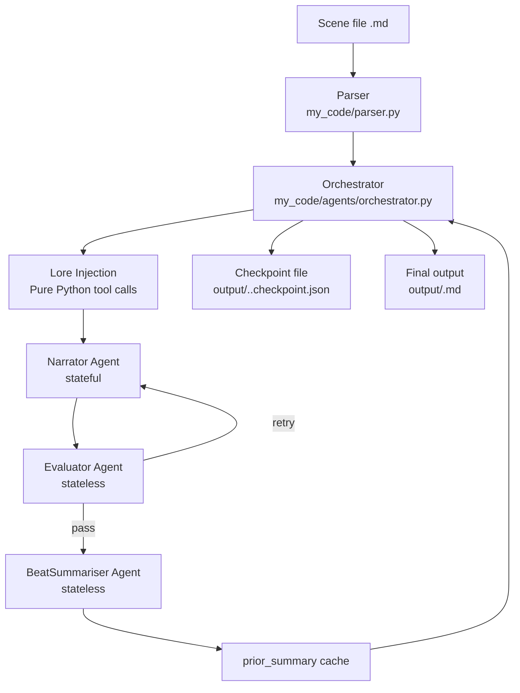
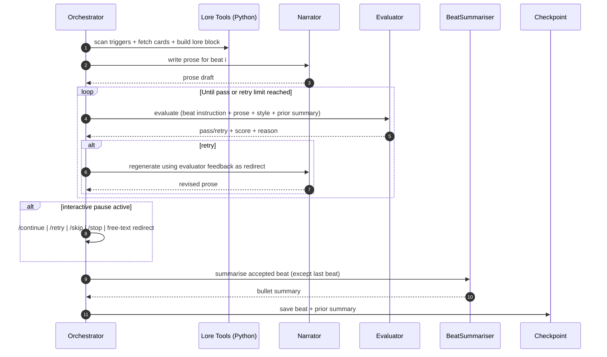

# Story Engine Agent Architecture and Workflow

This document describes the current, code-level agentic workflow used by Story Engine.

It focuses on what actually runs today in the orchestrator loop, how each agent is configured, and how data moves between components.

## 1. High-Level Architecture



## 2. Agent Roles

### 2.1 Orchestrator (Coordinator)

File: `my_code/agents/orchestrator.py`

Responsibilities:
- Parse scene input and resolve execution mode.
- Create sub-agents once per run.
- Run beat loop and control retries.
- Handle human-in-the-loop commands in interactive modes.
- Persist progress to checkpoint after each accepted beat.
- Assemble final output and clear checkpoint on successful completion.

Key behaviors:
- `MAX_RETRIES = 3` for evaluator-driven re-generation attempts.
- Evaluator has three fallback modes (see §2.4). All log `EVALUATOR FALLBACK` at WARNING level.
- Completed beats from checkpoints are replayed into narrator context to preserve continuity.
- `_trim_narrator_context(narrator)` is called after each beat to proactively reduce the narrator's
  conversation history before the server rejects the next request (see §2.3).

### 2.2 Lore Injection (Context Builder)

Files:
- `my_code/agents/orchestrator.py` (`_call_lore_injector`)
- `my_code/tools/lore_tools.py`

Current implementation details:
- Lore injection is executed as direct Python tool calls (no LLM call in the runtime loop).
- It scans beat text for trigger keywords, fetches matched character cards, then builds a compact lore block.

Tool order used at runtime:
1. `scan_for_triggers`
2. `get_character_card` (for each match)
3. `build_lore_block`

Note:
- `my_code/agents/lore_injector.py` still defines a legacy LLM LoreInjector agent factory, but the orchestrator now uses the pure Python path for performance.

### 2.3 Narrator (Writer)

File: `my_code/agents/narrator.py`

Responsibilities:
- Generate beat prose from instruction + lore + optional author note + optional human redirect.

State model:
- Stateful across beats via `SummarizingConversationManager(summary_ratio=0.3, preserve_recent_messages=6)`.
- Created **once per run** (must persist for KV cache continuity on port 8080).

Context management:
- `SummarizingConversationManager` is **reactive only** — it summarizes on `ContextWindowOverflowException`
  from the server, never proactively. Without intervention, narrator input grows ~1800 tokens/beat and
  exceeds ctx=12288 at beat ~7.
- `_trim_narrator_context(narrator)` in orchestrator.py is called after each accepted beat. It checks
  `len(narrator.messages) > preserve_recent_messages` and calls `reduce_context()` proactively.
- Log line `Narrator context trimmed: N → M messages` confirms reduction fired.

System prompt composition:
- Narrator prompt
- Writing style
- World info
- Scene setup (location/time/atmosphere if present)
- Scenario
- Optional writing instructions
- POV rule
- NSFW policy switch
- Per-beat target length guidance
- Player-character agency guardrail

### 2.4 Evaluator (Quality Gate)

File: `my_code/agents/evaluator.py`

Responsibilities:
- Evaluate each draft beat and return structured pass/retry JSON.

Checks performed:
1. Beat coverage
2. Style compliance
3. Coherence against prior beat summaries

Implementation details:
- Stateless (`NullConversationManager`).
- **Recreated fresh each beat** — prevents Strands SDK metric objects accumulating across beats.
- Tool-based checks from `my_code/tools/eval_tools.py`.
- Orchestrator trims prior summaries to recent window (`_EVALUATOR_PRIOR_SUMMARY_WINDOW = 10`) before evaluation.

Critical tool constraint:
- `check_beat_coverage`, `check_style_compliance`, `check_coherence` must NOT accept `prose_output`,
  `beat_instruction`, or `writing_style` as parameters. Repeating ~1200 tokens ×3 tool calls inflates
  output to ~5600 tokens, blowing past `ctx=4096` every beat. The evaluator appears to pass but has
  actually never evaluated anything — the fallback fires silently on every beat.
- Tools only accept boolean verdicts and reason/issues strings. The LLM already has the content in context.

Fallback behavior (three modes, all log `EVALUATOR FALLBACK` at WARNING):
1. Exception mid-call (e.g. `MaxTokensReachedException`) — caught by outer try/except
2. `result.stop_reason == "max_tokens"` on a completed result — checked after the call
3. JSON parse failure — caught when extracting the verdict from the response

A healthy run has zero EVALUATOR FALLBACK warnings.

### 2.5 BeatSummariser (Continuity Memory)

File: `my_code/agents/summariser.py`

Responsibilities:
- Convert accepted beat prose into 3 to 5 factual bullets.
- Feed continuity memory used by evaluator in later beats.

Implementation details:
- Stateless (`NullConversationManager`).
- **Recreated fresh each beat** — prevents Strands SDK metric objects accumulating across beats.
- Called for each accepted beat except the final beat.
- Appends output into `prior_summary` in orchestrator.

## 3. End-to-End Beat Lifecycle



## 4. Control-Flow by Execution Mode

### Autonomous
- No human intervention.
- Runs beats to completion unless fatal exception occurs.

### Interactive
- Pauses after every beat.
- Human commands supported:
  - Enter: continue
  - `/retry`: regenerate current beat
  - `/skip`: skip current beat
  - `/stop`: save checkpoint and stop run
  - free text: redirect instruction for narrator

### Semi-Interactive
- Pauses only on beats marked with `[pause]` in `[scene-beats]`.

## 5. Checkpoint and Resume Mechanics

Checkpoint file path:
- `output/.<output_stem>.checkpoint.json`

Stored state:
- `beats`: map of beat index to accepted prose
- `prior_summary`: accumulated summaries used for coherence checks

Resume behavior:
- On startup, orchestrator loads checkpoint if present.
- Completed beats are skipped in generation.
- Their instruction + prose are replayed into narrator conversation so narrative memory remains consistent.

Completion behavior:
- Final output is written to `meta.output_file`.
- Checkpoint file is deleted after successful completion.

## 6. Model Routing and Deployment Pattern

Model factory file:
- `my_code/models/provider.py`

Role-based endpoint/model routing:
- Narrator: `STORY_ENGINE_NARRATOR_BASE_URL`, `STORY_ENGINE_NARRATOR_MODEL`
- Evaluator: `STORY_ENGINE_EVALUATOR_BASE_URL`, `STORY_ENGINE_EVALUATOR_MODEL`
- Summariser: `STORY_ENGINE_SUMMARISER_BASE_URL`, `STORY_ENGINE_SUMMARISER_MODEL`
- Orchestrator role model variable exists but orchestrator itself is Python control flow

Recommended production pattern:
- Dedicated endpoint/model for Narrator (stateful, cache-sensitive).
- Separate fast endpoint/model for Evaluator + Summariser (stateless calls).
- Keep lore injection as pure Python to avoid unnecessary LLM calls.

## 7. Data Contracts Through the Loop

Primary input model:
- `ParsedScene` from `my_code/models/data_models.py`

Beat-time context model:
- `NarratorContext`
  - `beat_instruction`
  - `lore_context`
  - `beat_index`, `beat_total`
  - optional `author_note`
  - optional `redirect_instruction`

Evaluator output model:
- `EvalResult`
  - `result` (`pass` or `retry`)
  - `score`
  - `reason`
  - booleans: coverage/style/coherence
  - `issues` list

## 8. Failure and Safety Behavior

Designed non-fatal fallbacks:
- Evaluator exception mid-call → auto-pass, logs `EVALUATOR FALLBACK: <ExcType> raised mid-call`.
- Evaluator `stop_reason=max_tokens` → auto-pass, logs `EVALUATOR FALLBACK: stop_reason=max_tokens`.
- Evaluator JSON parse failure → auto-pass, logs `EVALUATOR FALLBACK: JSON parse failed` with raw excerpt.
- `EOFError` during human prompt (no terminal attached) → auto-continue.

Operational implication:
- Pipeline favors forward progress and completion over strict hard-stop validation.
- EVALUATOR FALLBACK at WARNING level is the signal to watch. Zero warnings = evaluator is working.

## 9. Practical Performance Notes

Why current architecture performs better:
- Stateful narrator conversation is preserved within one agent instance for the full run.
- Lore injection no longer spends an LLM turn.
- Stateless evaluative work is isolated and can run on smaller/faster models.
- Prior summary window trimming prevents evaluator prompt growth from becoming unbounded.

## 10. Minimal Workflow Pseudocode

```text
scene = parse_scene_file(...)
checkpoint = load_checkpoint(...)

narrator = create_narrator(scene)  # once per run — stateful

for beat in scene.beats not in checkpoint:
    evaluator = create_evaluator()   # fresh per beat — stateless
    summariser = create_summariser() # fresh per beat — stateless

replay_completed_beats_into_narrator(checkpoint)

for beat in scene.beats not in checkpoint:
    lore = build_lore_via_python_tools(beat, scene.characters, scene.world_info)
    ctx = make_narrator_context(beat, lore, author_note, maybe_redirect)

    prose = narrator(ctx)
    prose = retry_with_evaluator_feedback_until_pass_or_max(prose)

    prose = maybe_human_override_or_retry(prose)

    trim_narrator_context_if_needed(narrator)  # proactive — don't wait for server overflow

    save_beat(checkpoint, prose)
    if not last_beat:
        prior_summary += summariser(prose)
    save_checkpoint(checkpoint)

write_final_output(...)
clear_checkpoint(...)
```

---

If you are extending this system, start in:
- `my_code/agents/orchestrator.py` for workflow changes
- `my_code/agents/narrator.py` for voice/context behavior
- `my_code/agents/evaluator.py` and `my_code/tools/eval_tools.py` for quality policy
- `my_code/tools/lore_tools.py` for lore retrieval behavior